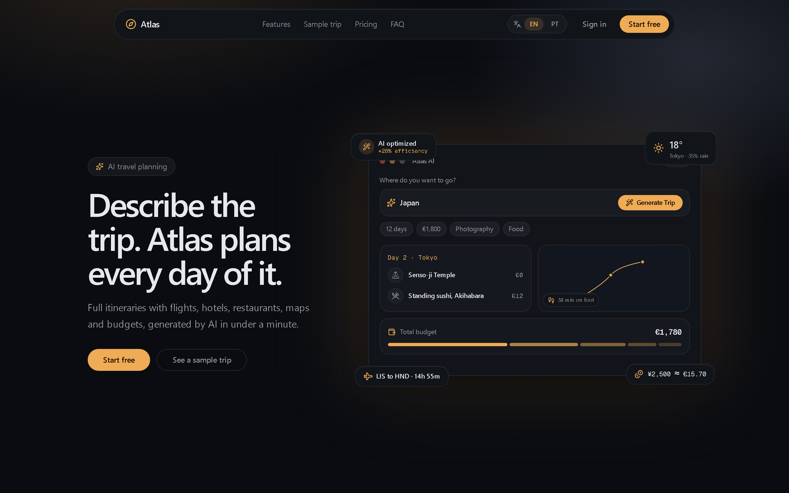
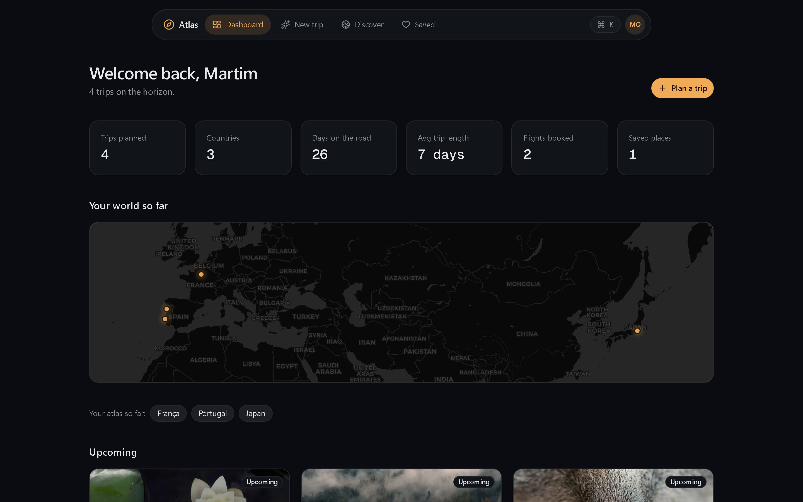
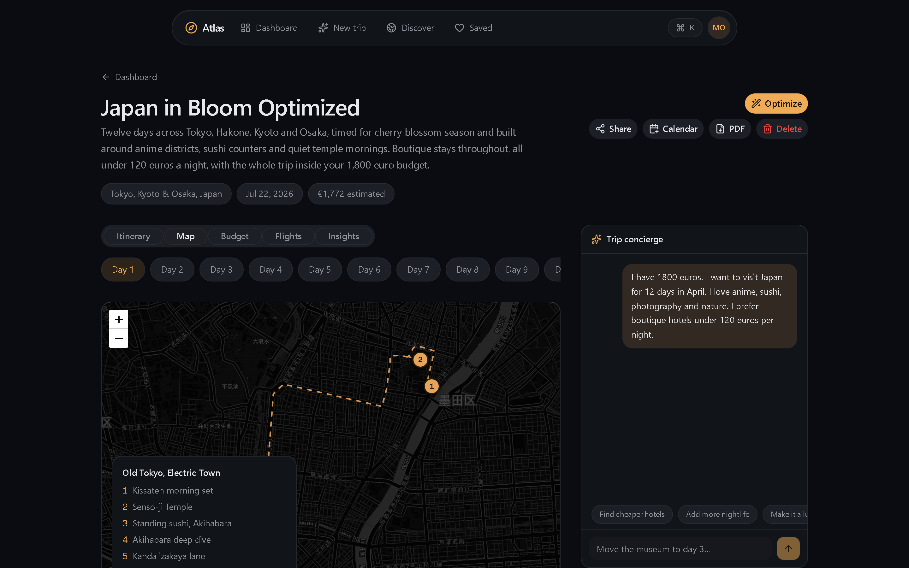
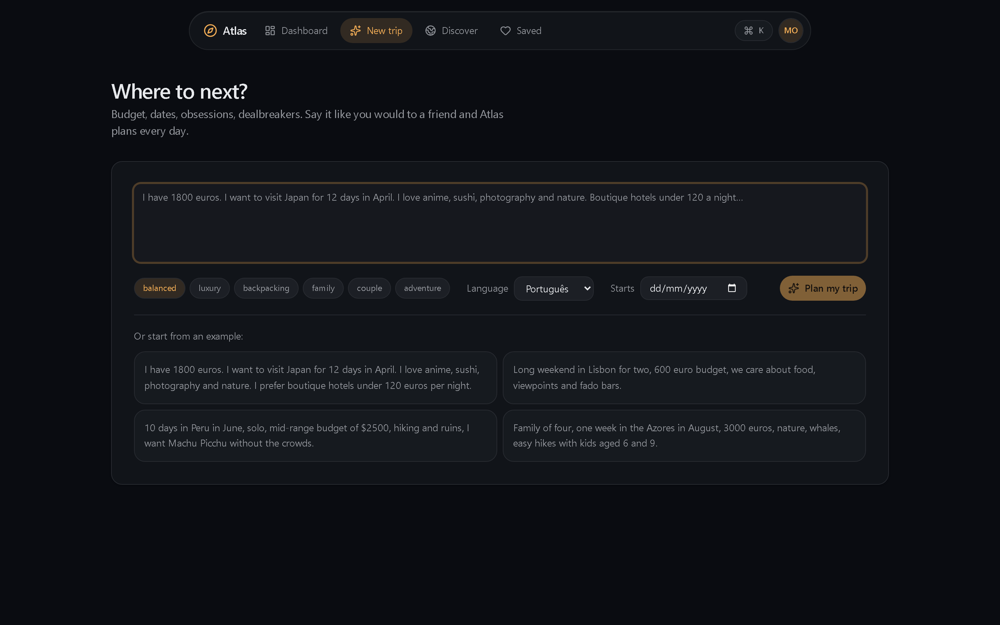
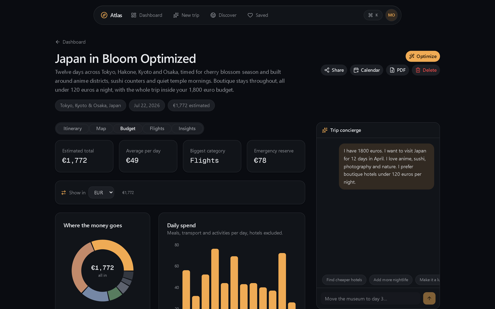
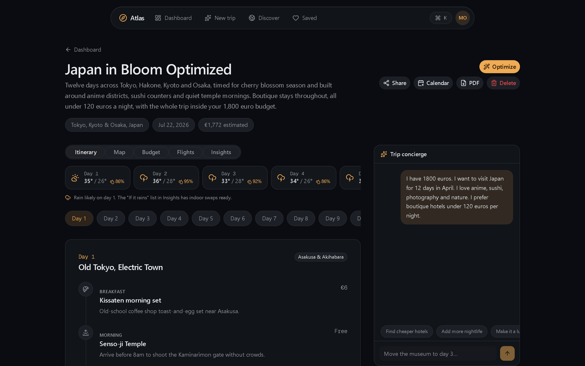
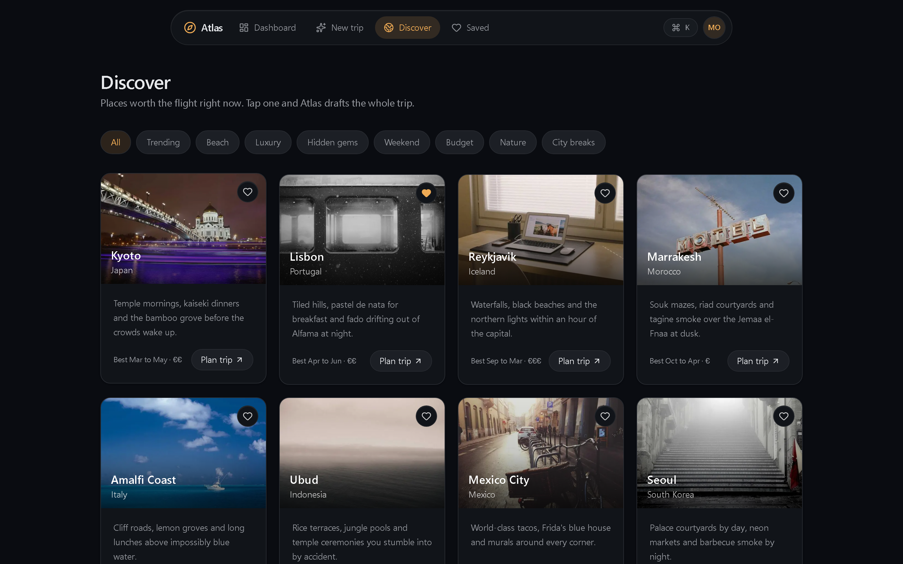
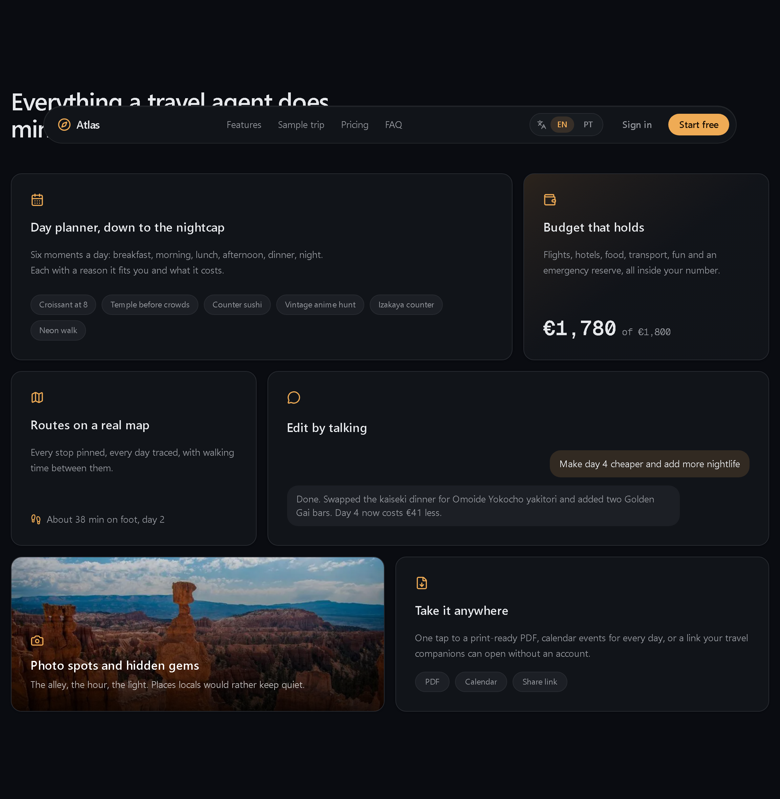

<div align="center">

# 🧭 Atlas AI

### The AI travel planner that plans your whole trip from a single sentence.

Describe your dream trip in plain language and Atlas generates a complete, day-by-day plan — flights, hotels, restaurants, maps, budgets and local tips — in under a minute. Then refine it by chatting, reorder it by dragging, optimize it with one click, and export it anywhere.




</div>

---

## ✨ Overview

Atlas AI is a production-ready SaaS that turns a natural-language request such as
_"I have €1,800, I want 12 days in Japan in April, I love anime, sushi and photography"_
into a full itinerary you can actually travel with. It streams a structured plan from
**Google Gemini**, maps every stop with real walking routes, tracks the budget live,
pulls in real weather and exchange rates, and lets you keep editing by chatting with a
concierge. Dark-first, fully responsive, and available in **English and Portuguese**.

Without any API keys it runs in **demo mode** (a built-in sample trip), so you can clone
and `npm run dev` with zero setup.

---

## 📸 Screenshots

|  |  |
|---|---|
| **Dashboard** — stats, world map & trips | **Trip · Interactive map** |
|  |  |
| **Plan a trip** — natural language input | **Budget dashboard & currency** |
|  |  |
| **Day-by-day itinerary** | **Discover destinations** |
|  |  |

<div align="center">

**Landing — feature overview**



</div>

---

## 🚀 Features

### AI planning
- **One-sentence generation** — structured, streamed itinerary from Google Gemini, validated end-to-end with Zod.
- **Multi-language content** — generate the entire plan in 8 languages (EN, PT, ES, FR, IT, DE, NL, JA).
- **AI Trip Optimizer ⭐** — analyzes geography, opening hours and crowds, reorders your days and shows a report (transit time saved, cost reduced, efficiency gain).
- **Trip concierge chat** — edit the itinerary in plain language ("make day 4 cheaper", "add nightlife", "family version") and watch it rewrite.
- **Smart PDF import** — upload a flight or hotel confirmation and Gemini extracts flights, hotels, times and booking refs, then merges them into the trip.

### The trip, fully realized
- **Day planner** — six moments a day (breakfast → night) with costs, transit and an insider tip. **Drag & drop** to reorder days and activities.
- **Interactive map** — Leaflet + dark tiles with **real walking routes** (OSRM), an animated route, numbered pins, per-day view and today-highlighting.
- **Budget dashboard** — category breakdown and daily-spend charts (Recharts) plus a **live currency converter** (real ECB rates, 8 currencies).
- **Flight timeline** — legs, durations, layovers, terminals, gates, baggage and timezone changes.
- **Live weather** — real 16-day forecast per day (Open-Meteo) with rain alerts and indoor alternatives.
- **Insights** — hotel picks (with photos + one-click Booking search), best time to go, packing checklist with progress, hidden gems, photo spots, safety notes.

### Around the product
- **Travel dashboard** — trips, countries, days on the road, average length, flights booked, plus an **interactive world map** of everywhere you've been.
- **Discover** — curated destinations with filters and one-click "plan this trip".
- **Export** — one-click **PDF** (server-rendered, localized), **calendar (.ics)** and public **share links**.
- **Polished UX** — command palette (⌘K), toasts, loading skeletons, optimistic updates, streaming, lazy-loaded charts/maps and beautiful empty states.
- **i18n** — full English/Portuguese interface with a cookie-based language switcher.
- **Auth & limits** — email/password auth (Auth.js v5) and a lifetime free-tier trip cap.

---

## 🧱 Tech stack

| Area | Choice |
|---|---|
| Framework | **Next.js 15** — App Router, Server Components, Server Actions, streaming |
| Language | **TypeScript** (strict) |
| Styling | **Tailwind CSS v4** + **shadcn/ui** + **Framer Motion** |
| Database | **Prisma** + **PostgreSQL** (Neon) |
| Auth | **Auth.js v5** (credentials, JWT sessions) |
| AI | **Vercel AI SDK** + **Google Gemini** (structured streaming) |
| Maps | **Leaflet** + Carto dark tiles + **OSRM** routing — no key required |
| Charts | **Recharts** · **Drag & drop** dnd-kit · **PDF** @react-pdf/renderer |
| Live data | **Open-Meteo** (weather) · **Frankfurter/ECB** (rates) — all keyless |
| Misc | Zod · React Hook Form · Lucide · Sonner |

---

## 🏁 Getting started

```bash
# 1. Install
npm install

# 2. Configure (see the table below — only DATABASE_URL and AUTH_SECRET are required)
cp .env.example .env
#    AUTH_SECRET:  openssl rand -base64 32

# 3. Create the tables
npx prisma db push

# 4. Run
npm run dev
```

Open <http://localhost:3000>, create an account, and your first sample trip
(12 days in Japan) is already waiting. Without a Gemini key the planner serves the
built-in sample so everything is clickable out of the box.

### Environment variables

| Variable | Required | Purpose |
|---|---|---|
| `DATABASE_URL` | ✅ | PostgreSQL connection string (a free Neon database works great) |
| `AUTH_SECRET` | ✅ | Session encryption — `openssl rand -base64 32` |
| `GOOGLE_GENERATIVE_AI_API_KEY` | — | Real AI generation & chat. Free key (no card): <https://aistudio.google.com/app/apikey> |
| `GEMINI_MODEL` | — | Defaults to `gemini-flash-lite-latest` |

Maps (Leaflet + Carto), weather (Open-Meteo), currency (ECB) and routing (OSRM) all
work with **no keys and no accounts**.

---

## 📦 Deployment notes

- **Database** — the schema targets PostgreSQL; point `DATABASE_URL` at any Postgres instance and run `npx prisma db push`.
- **Auth** — `trustHost: true` is set so `next start` / self-hosting works without extra config.
- **PDF export** — fonts are read at runtime and declared in `outputFileTracingIncludes`, so serverless deploys (e.g. Vercel) ship them correctly.
- **Performance** — external-API sections stream via `<Suspense>`, heavy charts are lazy-loaded, and there is an instant `loading.tsx` for every route.

---

## 🗂️ Project structure

```
app/            App Router — (app) protected pages, (auth) sign in, api/ routes, share/
components/     UI + feature components (hero demo, trip map, optimizer, flight timeline…)
lib/            domain logic — AI schemas, i18n, weather/rates/flights, server actions
prisma/         schema
docs/           screenshots
scripts/        sample-trip self-check, screenshot generator
```

---

## 📝 Notes

- This is a portfolio project. The AI-suggested hotels link to a prefilled Booking.com
  search (there are no real reservation deep links to fabricate).
- Prices are realistic estimates for budgeting, not live inventory.

<div align="center">

Built with care · planned with AI

</div>
